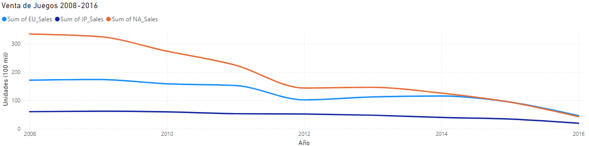
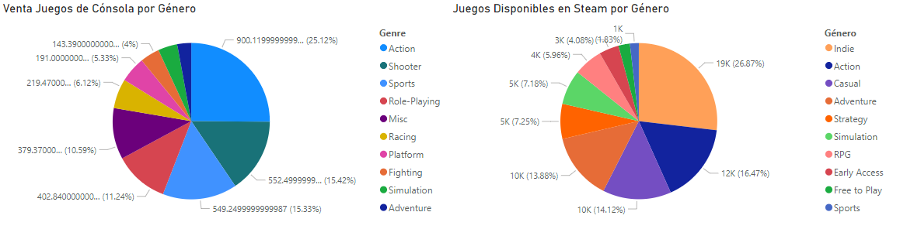
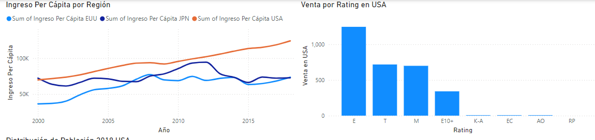
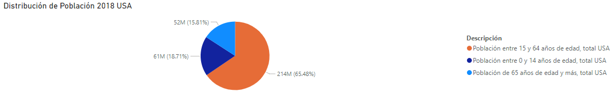
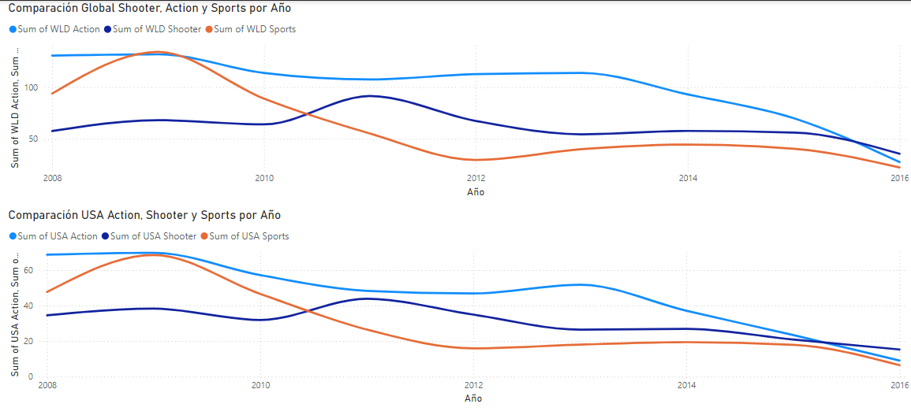

# Análisis Mercado de Videojuegos

## Introducción

Este es un análisis realizado para Soy Henry, el mismo forma parte del proyecto integrador del M5, los datos utilizados fueron los suministrados al inicio del módulo.

## ¿Qué análisis podemos hacer del mercado actual?

La venta de videojuegos viene presentando una tendencia decreciente a partir del año 2008 en las regiones analizadas, estas son Estados Unidos, Unión Europea y Japón.

Ahora bien, se observa que hay una migración de la población hacia los videojuegos en líneas en donde podemos observar que hay un cambio en el comportamiento de los jugadores respecto a los videojuegos de consola, destacando juegos indie por encima de juegos de acción, los cuales venían marcando la tendencia en consolas.

## Importancia de identificar la población y la región objetivos

A través de la data se observa que la población de Estados Unidos tiene un ingreso per cápita mayor que las otras regiones analizadas, lo que la posiciona como la región objetivo para nuevos lanzamientos, además de esto podemos agregar que el Rating de videojuegos más vendido en la región de Estado es el que corresponde a todo público seguido por el contenido para Adolescentes.

Si tomamos en cuenta la distribución de la población de Estados Unidos, sería muy acertado que los lanzamientos de videojuegos que estimas los inversores se encuentre dentro de la clasificación para todo público en su defecto en la clasificación apto para Adolescentes.

Ahora bien, haciendo una observación en el comportamiento de los Géneros más vendidos en el período comprendido entre 2008 y 2016 se recomienda aprovechar el género Shooter que ha tenido un repunte en mercado norteamericano ubicándose incluso por encima del género de acción que había sido el género más importante en los últimos años.

